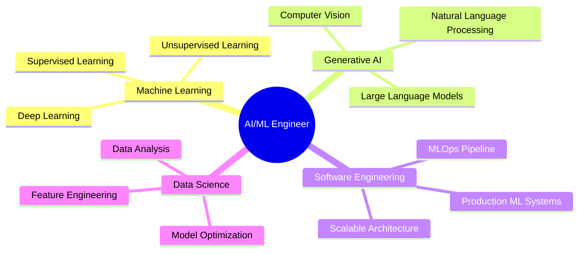

<div align="center">

# 👨‍💻 Mohamed IFQIR

### AI & ML Engineer | Tech Enthusiast | Software Developer


[](https://medifqir.42web.io/)
[](https://www.linkedin.com/in/mohamed-ifqir-329840242/)
[](mailto:mohamedifqir99@gmail.com)


</div>

## 🚀 About Me

```python
class AIEngineer:
    def __init__(self):
        self.name = "Mohamed IFQIR"
        self.role = "AI & ML Engineer"
        self.passion = ["Building Intelligent Systems", "ML Research", "Software Innovation"]
        
    def say_hi(self):
        print("Crafting tomorrow's technology through algorithms and innovation.")

me = AIEngineer()
me.say_hi()
```


## 🛠️ Technical Arsenal

<table>
<tr>
<td valign="top" width="50%">

### Languages


### AI/ML Frameworks


</td>
<td valign="top" width="50%">

### Big Data & Tools


### MLOps / DevOps


</td>
</tr>
</table>


## 🎯 Focus Areas




## 📊 GitHub Analytics

<p align="center">
  
  
</p>

<p align="center">
  
</p>


<div align="center">

### 💡 Current Mission

*Mastering AI-driven software development • Building production-grade ML systems • Exploring the intersection of AI and software engineering*


**Thanks for visiting my profile!**


</div>
